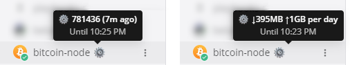
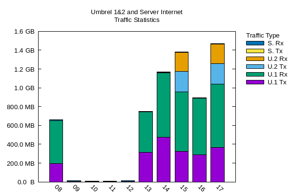

# Context

These procedures are intended for maintaining two Umbrel devices, one as a complete hardware backup of the other, in order to facilitate quick recovery regardless of the severity of the failure. For the sake of this documentation, the production node will be assigned the IP address of 192.168.0.10, and the backup hardware will be assigned the IP address of 192.168.0.20. A third (optional) Linux server is used for monitoring, backup, and reporting purposes and is assumed in this documentation to have an IP address of 192.168.0.15.

# Normal operation

The production Umbrel node runs full-time (optionally along with the monitoring server). The backup node is run only for IBD (initial blockchain download) and periodically thereafter to maintain a nearly complete backup Bitcoin blockchain that is always ready to be synced and used.During most of the time, this device remains switched off.

# Mattermost integration

The production Umbrel node will optionally transmit status updates as a specified Mattermost user. This allows quick access to the current height of the blockchain and other basic status info:

Additionally, select data is optionally reported to the monitoring server to enable generation of periodic reports via Mattermost using gnuplot, such as the following:

# How to use the procedures

To prepare a backup Umbrel node, use the [Umbrel Setup](010_Umbrel_Setup.md) checklist.

To upgrade a backup Umbrel node for production use, use the [Recover After Failure](020_Recover_After_Failure.md) checklist.

To establish or restore a production Umbrel node when no backup node has been prepared, use the [Umbrel Setup](010_Umbrel_Setup.md) checklist followed by the [Recover After Failure](020_Recover_After_Failure.md) checklist.

# Reference hardware

- Raspberry Pi 4, 8GB RAM w/cooling case
- 128 GB SD card
- Externally powered USB SATA dock
- 2TB SSD
